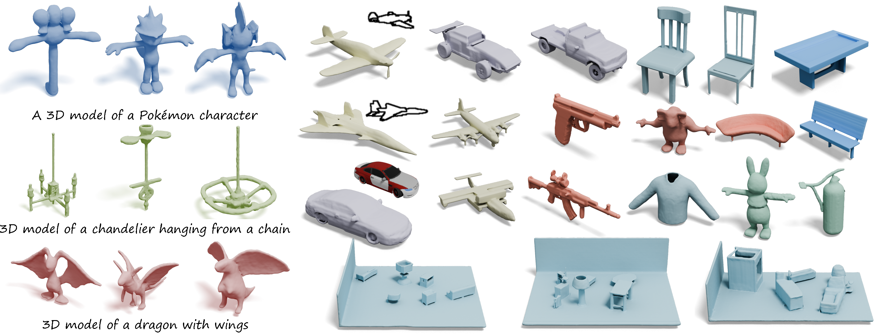

# OctGPT: Octree-based Multiscale Autoregressive Models for 3D Shape Generation

This repository contains the implementation of **OctGPT**. The code is
released under the **MIT license**. 


**[OctGPT: Octree-based Multiscale Autoregressive Models for 3D Shape Generation](http://arxiv.org/)**<br/>
Si-Tong Wei, Rui-Huan Wang, Chuan-Zhi Zhou, [Baoquan Chen](https://baoquanchen.info/), [Peng-Shuai Wang](https://wang-ps.github.io/)<br/>
Accepted by SIGGRAPH 2025




- [OctGPT: Octree-based Multiscale Autoregressive Models for 3D Shape Generation](#octgpt-octree-based-multiscale-autoregressive-models-for-3d-shape-generation)
  - [1. Installation](#1-installation)
  - [2. ShapeNet](#2-shapenet)
  - [3. Objaverse](#3-objaverse)
  - [4. Citation](#4-citation)


## 1. Installation

The code has been tested on Ubuntu 20.04 and CUDA 12.4.


1. Install [Conda](https://www.anaconda.com/) and create a `Conda` environment.

    ```bash
    conda create --name octgpt python=3.10
    conda activate octgpt
    ```

2. Install PyTorch-2.5 with conda according to the official documentation.

    ```bash
    pip install torch==2.5.1 torchvision==0.20.1 torchaudio==2.5.1 --index-url https://download.pytorch.org/whl/cu124
    ```

3. Clone this repository and install the requirements.

    ```bash
    git clone https://github.com/octree-nn/octgpt.git
    cd  octgpt
    pip install -r requirements.txt
    ```

## 2. ShapeNet

### 2.1 Download pre-trained models
We provide the pretrained models for unconditional and category-condition generation. Please download the pretrained models from [Hugging Face](https://huggingface.co/wst2001/OctGPT) and put them in `saved_ckpt`.

### 2.2 Generation
1. Unconditional generation in category `airplane`, `car`, `chair`, `rifle`, `table`.
```bash
export category=airplane && \
python main_octgpt.py \
--config configs/ShapeNet/shapenet_uncond.yaml \
SOLVER.run generate \
SOLVER.ckpt saved_ckpt/octgpt_${category}.pth \
SOLVER.logdir logs/${category} \
MODEL.vqvae_ckpt saved_ckpt/vqvae_large_im5_uncond_bsq32.pth \
MODEL.OctGPT.patch_size 2048 \
MODEL.OctGPT.dilation 2
```

2. Category-conditioned generation
```bash
export category=airplane && \
python main_octgpt.py \
--config configs/ShapeNet/shapenet_uncond.yaml \
SOLVER.run generate \
SOLVER.ckpt saved_ckpt/octgpt_im5.pth \
SOLVER.logdir logs/im5 \
MODEL.vqvae_ckpt saved_ckpt/vqvae_large_im5_cond_bsq32.pth \
MODEL.OctGPT.condition_type category \
MODEL.OctGPT.num_classes 5 \
MODEL.OctGPT.patch_size 1024 \
MODEL.OctGPT.dilation 16 \
DATA.test.category ${category}
```

### 2.3 Training
#### 2.3.1 Data Preparation

1. Download `ShapeNetCore.v1.zip` (31G) from [ShapeNet](https://shapenet.org/) and place it in `data/ShapeNet/ShapeNetCore.v1.zip`. Download `filelist` from [HuggingFace](https://huggingface.co/wst2001/OctGPT) and place it in `data/ShapeNet/filelist`.

2. Convert the meshes in `ShapeNetCore.v1` to signed distance fields (SDFs).
We use the same data preparation as [DualOctreeGNN](https://github.com/microsoft/DualOctreeGNN.git) and [OctFusion](https://github.com/octree-nn/octfusion). We utilize [mesh2sdf](https://github.com/wang-ps/mesh2sdf) and [cumesh2sdf](https://github.com/eliphatfs/cumesh2sdf). Note that cumesh2sdf is much faster but has some errors when the sampling points are far from surface.
```bash
python tools/sample_sdf.py --mode cpu --dataset ShapeNet
```
#### 2.3.2 Training Setup

1. Unconditional Generation
```bash
export category=airplane && \
python main_octgpt.py \
--config configs/ShapeNet/shapenet_uncond.yaml \
SOLVER.run train \
SOLVER.gpu 0,1,2,3 \
SOLVER.logdir logs/${category} \
MODEL.vqvae_ckpt saved_ckpt/vqvae_large_im5_uncond_bsq32.pth
```

2. Category-condition Generation
```bash
python main_octgpt.py \
--config configs/ShapeNet/shapenet_uncond.yaml \
SOLVER.run train \
SOLVER.gpu 0,1,2,3 \
SOLVER.logdir logs/im5 \
MODEL.vqvae_ckpt saved_ckpt/vqvae_large_im5_cond_bsq32.pth \
MODEL.OctGPT.condition_type category \
MODEL.OctGPT.num_classes 5
```

## 3. Objaverse
### 3.1 Download pre-trained models
Download the pretrained models from [Hugging Face](https://huggingface.co/wst2001/OctGPT) and put them in `saved_ckpt`.

### 3.2 Text-condition Generation
Generate based on a specific text prompt
```bash
python main_octgpt.py \
--config configs/Objaverse/objaverse_octar_text.yaml \
SOLVER.run generate \
SOLVER.logdir logs/obja_text \
SOLVER.ckpt saved_ckpt/octgpt_objv_text.pth \
MODEL.vqvae_ckpt saved_ckpt/vqvae_large_objv_bsq32.pth \
DATA.test.text_prompt "A 3D model of a Pokémon character."
```

<!-- ### 3.3 Training
#### 3.3.1 Data Preparation
We adopt the data filtering and preprocessing pipeline from from [TRELLIS](https://github.com/Microsoft/TRELLIS). Our model is trained on a subset of `ObjaverseXL-sketchfab` containing 16w 3D meshes.
To replicate our experimental setup, please follow these steps:
- Place the raw dataset in `data/Objaverse/ObjaverseXL_sketchfab/raw`.
- Store the metadata file in `data/Objaverse/ObjaverseXL_sketchfab/metadata.csv`.
- Conduct mesh repairing and save the processed meshes to `data/Objaverse/ObjaverseXL_sketchfab/datasets_512`.
```bash
python tools/sample_sdf.py --mode cuda --dataset Objaverse --depth 9
```
#### 3.3.2 Training Setup
```bash
python main_octgpt.py \
--config configs/Objaverse/objaverse_octar_text.yaml \
SOLVER.run train \
SOLVER.gpu 0,1,2,3,4,5,6,7 \
SOLVER.logdir logs/obja_text \
MODEL.vqvae_ckpt saved_ckpt/vqvae_huge_objv_bsq64.pth \
``` -->

## 4. Citation
```bibtex
@article {wei2025octgpt,
    title      = {OctGPT: Octree-based Multiscale Autoregressive Models for 3D Shape Generation},
    author     = {Wei, Si-Tong and Wang, Rui-Huan and Zhou, Chuan-Zhi and Chen, Baoquan and Wang Peng-Shuai},
    journal    = {arXiv preprint arXiv:},
    year       = {2025},
}
```